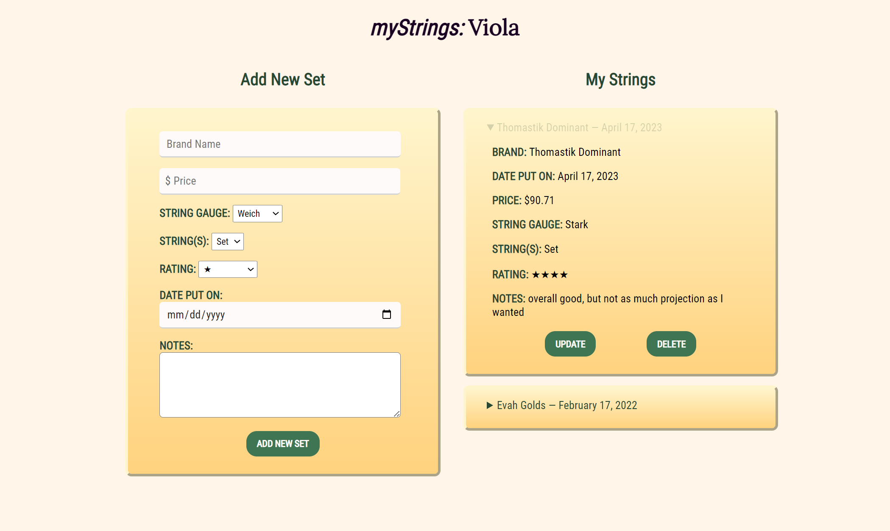

# myStrings: Viola

myStrings: Viola is a web application designed for use by violists looking to keep a log of the sets of strings they have used. Users can submit information about a set of strings for future reference when determining what set they may wish to buy next.

Eventual features I would like to add down the line are a multi-user login page, database integration, as well as variant views for violinists and cellists. 

## Technologies Used

* JavaScript
* HTML
* CSS

## Dependencies

* express
* cors
* axios
